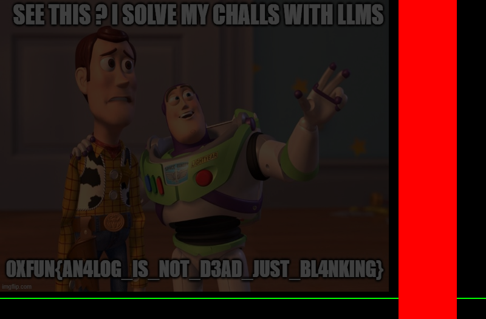

## Challenge Overview

**Category:** Forensics
**Objective:** Extract a hidden image from a raw VGA signal capture.
**File provided:** `signal.bin` (2,100,225 bytes)

## 1. Initial Analysis

First, let's examine the file structure:

```bash
$ xxd signal.bin | head -20
00000000: 6368 6563 6b20 7472 6169 6c65 722e 2066  check trailer. f
00000010: 6f72 2068 696e 742e 0a20 1818 0101 2018  or hint.. .... .
```

The file starts with a text message: `"check trailer. for hint.\n"`. Following this hint, we check the end of the file:

```bash
$ tail -c 200 signal.bin | xxd
00000000: 504b 0304 1400 0000 0800 2ea6 4b5c 48b6  PK..........K\H.
```

The `PK\x03\x04` magic bytes indicate a ZIP file is appended at the trailer.

## 2. Extracting the Hint

```python
with open('signal.bin', 'rb') as f:
    data = f.read()
    zip_offset = data.find(b'PK\x03\x04')
    # Extract ZIP
    zip_data = data[zip_offset:]
```

Unzipping reveals `hint.txt` with a red herring trigger string (common in LLM-based CTFs).

## 3. Signal Format Analysis

After excluding the text header (25 bytes) and ZIP trailer (200 bytes), we have:

- **Signal data:** 2,100,000 bytes
- **Samples:** 2,100,000 ÷ 5 = 420,000 samples
- **Dimensions:** 420,000 = 800 × 525

This matches the standard **VGA 640×480 @ 60Hz** timing:

| Parameter | Value |
|-----------|-------|
| Visible pixels per line | 640 |
| Horizontal blanking | 160 (16 front porch + 96 sync + 48 back porch) |
| Total pixels per line | 800 |
| Visible lines | 480 |
| Vertical blanking | 45 (10 front porch + 2 sync + 33 back porch) |
| Total lines | 525 |

**Data format per sample (5 bytes):**

| Byte | Description |
|------|-------------|
| 0 | Red (R) |
| 1 | Green (G) |
| 2 | Blue (B) |
| 3 | HSYNC (horizontal sync, active low) |
| 4 | VSYNC (vertical sync, active low) |

## 4. Sync Timing Verification

```python
# HSYNC active (low) at columns 656-751 (96 pixels)
# VSYNC active (low) at rows 490-491 (2 lines)
```

Both match the standard VGA specification exactly.

## 5. Image Extraction

```python
from PIL import Image

TOTAL_WIDTH = 800
VISIBLE_WIDTH = 640
VISIBLE_HEIGHT = 480

img = Image.new('RGB', (VISIBLE_WIDTH, VISIBLE_HEIGHT))
pixels = img.load()

for row in range(VISIBLE_HEIGHT):
    for col in range(VISIBLE_WIDTH):
        sample_idx = row * TOTAL_WIDTH + col
        r, g, b, hsync, vsync = samples[sample_idx]
        pixels[col, row] = (r, g, b)

img.save('flag.png')
```

## 6. Flag

The decoded image reveals a Toy Story meme with the flag:



```text
0XFUN{AN4LOG_IS_NOT_D3AD_JUST_BL4NKING}
```
