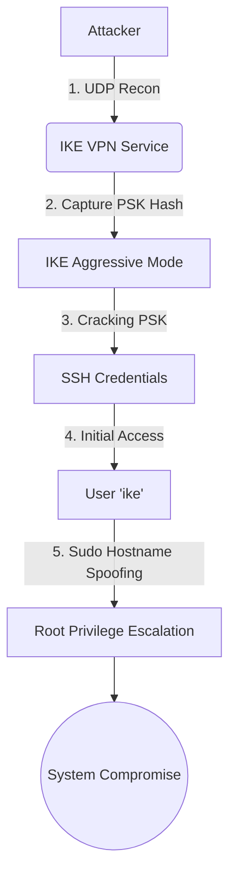

## Executive Summary

This assessment details the compromise of the **Expressway** machine (10.10.11.87). While initial reconnaissance identified a critical information disclosure vulnerability in the Squid proxy (CVE-2025-62168), the successful exploitation path leveraged a misconfigured IKE VPN service.

The attack chain involved capturing and cracking an **IKE Aggressive Mode Pre-Shared Key (PSK)** to obtain SSH credentials. Privilege escalation to `root` was achieved by exploiting a custom `sudo` binary that allowed hostname spoofing to bypass user restrictions.

| Category | Difficulty | User Flag | Root Flag |
|----------|------------|-----------|-----------|
| Linux Machine | Easy | `689998**************************` | `7cbb6e**************************` |

---

## Attack Chain Visualization



---

## Vulnerability Details

### 1. IKE Aggressive Mode PSK Disclosure

**Severity:** High

**Description:**
The IKE (Internet Key Exchange) service running on UDP port 500 was configured with Aggressive Mode. This mode allows the server to send the hashed Pre-Shared Key (PSK) in response to an initialization packet, which can be captured and cracked offline.

**Exploitation:**
Using `ike-scan`, we identified the VPN ID (`ike@expressway.htb`) and captured the hash. The captured hash was cracked using a dictionary attack to recover the plaintext PSK.

-   **ID:** `ike@expressway.htb`
-   **Cracked PSK:** `freakingrockstarontheroad`

This PSK was reused as the password for the `ike` SSH user, granting initial system access.

---

### 2. Sudo Hostname Spoofing (Privilege Escalation)

**Severity:** Critical

**Description:**
A custom `sudo` binary located at `/usr/local/bin/sudo` contained a flaw where it trusted the `-h` (hostname) flag provided by the user. The `ike` user was restricted from running `sudo` on the current host, but the policy allowed access from `offramp.expressway.htb`.

**Exploitation:**
By checking the SUID binaries, we distinguished the custom `sudo` from the system default. We executed the binary with the `-h` flag to spoof the trusted hostname, bypassing the restriction and gaining a root shell.

```bash
/usr/local/bin/sudo -h offramp.expressway.htb -i
```

---

### 3. Squid Proxy Information Disclosure (CVE-2025-62168)

**Severity:** Critical (Unexploited in this chain)

**Description:**
The Squid proxy (v7.1) on port 8888 was vulnerable to CVE-2025-62168, which allows leaking HTTP headers (Authtokens, Cookies) via generated error pages.

**Impact:**
While we confirmed the vulnerability by sending requests with Basic Auth and observing the credentials reflected in the error page's `mailto` link, we did not find any internal services that automatically injected credentials, making this vector a "rabbit hole" for this specific assessment.

---

## Remediation Recommendations

1.  **Disable IKE Aggressive Mode:** Reconfigure the VPN to use Main Mode, which encrypts the hash exchange, preventing offline cracking.
2.  **Weak Passwords:** Enforce a strong password policy to prevent dictionary attacks against PSKs and user accounts.
3.  **Sudo Security:** Remove the custom `sudo` binary or patch it to ignore user-supplied hostnames for authorization checks. Rely on the standard system `sudo` with a secure `/etc/sudoers` configuration.
4.  **Patch Squid Proxy:** Update Squid to a version patched against CVE-2025-62168 to prevent potential information disclosure.
