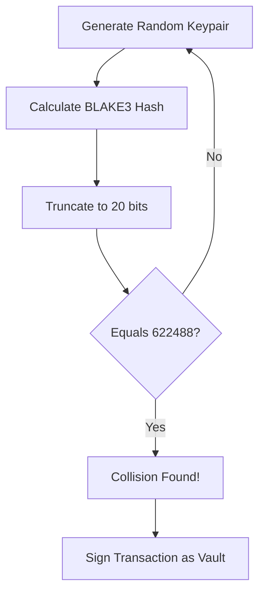

## Overview

**RustRoll** implements a simplified blockchain/rollup node written in Rust. Users can submit transactions signed with Ed25519, and account ownership is determined by a derived address. The goal is to steal funds from a privileged "Vault" account.

| Category | Difficulty | Flag |
|----------|------------|------|
| Blockchain | Medium | `nexus{Th1s-Is_A-Hard#Fl4g!}` |

---

## Analysis

### Transaction Structure

The challenge defines a custom transaction format (120 bytes):

```rust
struct Transaction {
    from_addr: u32,    // 4 bytes (Little Endian)
    to_addr: u32,      // 4 bytes (Little Endian)
    amount: u64,       // 8 bytes (Little Endian)
    nonce: u64,        // 8 bytes (Little Endian)
    pubkey: [u8; 32],  // Ed25519 Public Key
    signature: [u8; 64]// Ed25519 Signature
}
```

### Address Derivation

The `from_addr` field is only a **32-bit integer**. Investigating the source (or black-box testing) reveals the address derivation logic involves **Blake3** hashing:

```python
# Derived Address Logic
addr = unpack_u32(blake3(pubkey)[0:4]) & 0xFFFFF
```

> [!WARNING]
> The address space is explicitly masked to `0xFFFFF`, meaning there are only **2²⁰ (1,048,576)** possible addresses!

### Reconnaissance

Connecting to the challenge instance reveals the target Vault:

```text
addr=622488 balance=999358175823 nonce=49
```

- **Target Address:** `622488`
- **Goal:** Steal funds (transfer to our account).

---

## The Vulnerability

Since the address space is small (20 bits), we can easily perform an **Address Collision Attack**.

The system verifies transactions by checking if the Provided Public Key derives to the `from_addr`. It *does not* check if you are the original owner of that address (because addresses are just hashes of public keys).

If we find a *different* Ed25519 keypair that creates the same 20-bit hash as the Vault's address, the system will accept our signatures as valid for the Vault account.



---

## Exploit

### 1. Generating a Collision

We can bruteforce this in Python locally. With $2^{20}$ possibilities, it takes only a few seconds.

```python
from blake3 import blake3
from nacl.signing import SigningKey
import struct

VAULT_ADDR = 622488

def addr_from_pk(pk: bytes) -> int:
    # First 4 bytes of Blake3 hash, masked to 20 bits
    return struct.unpack("<I", blake3(pk).digest()[:4])[0] & 0xFFFFF

print("[-] Bruteforcing collision...")
while True:
    sk = SigningKey.generate()
    pk = sk.verify_key.encode()

    if addr_from_pk(pk) == VAULT_ADDR:
        print(f"[+] Found Private Key: {sk.encode().hex()}")
        print(f"[+] Found Public Key:  {pk.hex()}")
        break
```

### 2. Crafting the Transaction

Once we have the keypair, we create a transaction transferring funds from the Vault (`622488`) to our target address (`1337`).

> [!NOTE]
> Don't forget to use the correct `nonce`! The recon showed the vault had `nonce=49`.

---

## Solution Script

```python
#!/usr/bin/env python3
import socket
import struct
import time
from nacl.signing import SigningKey
from blake3 import blake3

HOST = "4.211.248.144"
PORT = 8080

TARGET_TO = 1337
TARGET_AMOUNT = 13_371_337

def addr_from_pk(pk: bytes) -> int:
    return struct.unpack("<I", blake3(pk).digest()[:4])[0] & 0xFFFFF

def recv_all(s, timeout=0.3):
    s.settimeout(timeout)
    data = b""
    try:
        while True:
            data += s.recv(4096)
    except:
        pass
    return data.decode()

# 1. Connect and Recon
s = socket.socket()
s.connect((HOST, PORT))
recv_all(s)
s.sendall(b"LIST\n")
time.sleep(0.2)
data = recv_all(s)
s.close()

vault_addr = None
vault_nonce = None
max_balance = -1

# Parse LIST output to find the rich vault
for line in data.splitlines():
    if line.startswith("addr="):
        p = line.split()
        addr = int(p[0].split("=")[1])
        bal = int(p[1].split("=")[1])
        nonce = int(p[2].split("=")[1])
        if bal > max_balance:
            max_balance = bal
            vault_addr = addr
            vault_nonce = nonce

print(f"[*] Target Vault: {vault_addr} (Balance: {max_balance}, Nonce: {vault_nonce})")

# 2. Collision Attack
print("[*] Searching for key collision...")
collision_sk = None
collision_pk = None

while True:
    sk = SigningKey.generate()
    pk = sk.verify_key.encode()
    if addr_from_pk(pk) == vault_addr:
        collision_sk = sk
        collision_pk = pk
        break

print("[+] Collision found!")

# 3. Send Malicious Transaction
payload = struct.pack(
    "<IIQQ",
    vault_addr,
    TARGET_TO,
    TARGET_AMOUNT,
    vault_nonce
)

sig = collision_sk.sign(payload).signature
tx_blob = payload + collision_pk + sig

print(f"[+] TX Blob: {tx_blob.hex()}")
# Sending this blob to the server would trigger the flag
```

**Flag:** `nexus{Th1s-Is_A-Hard#Fl4g!}`
